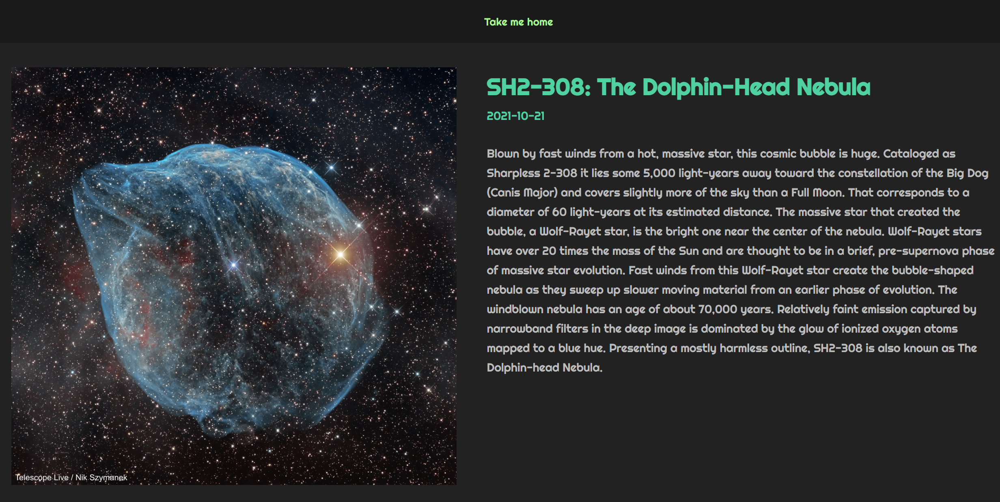

# NASA-apod

  
  
  
Simple picture of the day from [NASA API](https://api.nasa.gov/). Make sure you subscribe to api and generate a key for a configuration.

# Config
make sure to create `.env` file in this same folder as package.json. inside it create variables and set the NASA key.  
`REACT_APP_NASA_KEY=""`  

# Running
`npm start`

